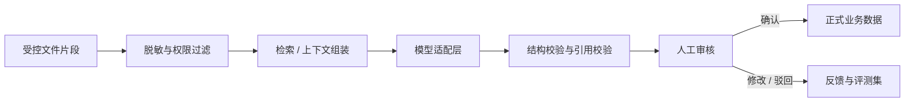

# 数据、评价与 AI 架构

## 1. 数据分层

系统把数据分为四类，避免把抽取结果、AI 建议和正式业务事实混在一起。

| 层级 | 内容 | 是否可直接用于正式评价 |
| --- | --- | --- |
| 原始证据层 | 原始文件、成绩记录、报告及其版本 | 需经过授权和映射 |
| 解析层 | 文本片段、表格、页码、OCR 结果 | 否 |
| 建议层 | AI 抽取字段、候选关系、解释和置信度 | 否，必须审核 |
| 正式业务层 | 已审核关系、评分规则、评价策略和改进闭环 | 是 |

## 2. 核心实体

### 2.1 标准与培养体系

- `StandardVersion`：认证标准版本。
- `GraduationRequirement`：毕业要求。
- `IndicatorPoint`：可评价的指标点。
- `Program` / `TrainingPlanVersion`：专业及培养方案版本。
- `Course` / `CourseOffering`：课程定义和具体开课周期。
- `CourseObjective`：课程目标版本。

### 2.2 实验教学

- `ExperimentProject`：稳定的实验项目身份。
- `ExperimentVersion`：某课程和周期下的实验内容版本。
- `ExperimentSection`：目的、步骤、环境、成果要求等结构化环节。
- `KnowledgePoint` / `SkillPoint` / `AbilityPoint`：待审核或正式能力要素。

### 2.3 评价与证据

- `Rubric` / `RubricCriterion`：评分规则和评分项。
- `ScoreRecord`：受控导入的原始或汇总评分记录。
- `EvidenceObject`：对象存储文件及其元数据。
- `EvidenceFragment`：带页码、段落、表格坐标和哈希的片段。
- `Mapping`：不同业务实体间的候选或正式关系。
- `EvaluationPolicyVersion`：公式、权重、阈值和缺失处理策略。
- `EvaluationRun`：一次不可变评价快照。

### 2.4 持续改进

- `QualityIssue`：证据缺口、达成度异常或结构问题。
- `ImprovementAction`：措施、负责人、期限和验证方法。
- `Reevaluation`：后续周期的复评结果。

### 2.5 治理

- `ReviewDecision`：确认、修改、驳回及原因。
- `ProcessingJob`：解析和分析任务状态。
- `AuditEvent`：关键操作、下载、审批和模型调用记录。

## 3. 版本与生效

以下内容修改时不得原地覆盖历史值：

- 认证标准、培养方案、课程目标和实验项目。
- Rubric、权重、阈值和达成度公式。
- 正式支撑关系。
- 原始文件和解析结果。
- 模型提示模板、模型配置和处理器版本。

每次正式评价应固定：

- 适用的业务版本集合。
- 输入数据范围和内容哈希。
- 评价策略版本。
- 样本量、缺失率和异常处理。
- 输出分布、阈值和结论。
- 运行时间、程序版本、发起人和审核人。

## 4. 确定性评价引擎

### 4.1 计算职责

评价引擎负责：

- 把评分项映射到课程目标或指标点。
- 按已批准权重聚合分数。
- 执行缺失值、异常值和有效样本规则。
- 计算个体、课程目标、课程和毕业要求层面的结果。
- 输出中间值和解释字段，支持逐层复核。

大模型不得参与数值计算路径。

### 4.2 策略化设计

不同专业可能使用不同方法，评价公式采用版本化策略，例如：

- 加权平均法。
- 阈值达标人数比例。
- 直接评价与间接评价组合。
- 多课程对同一毕业要求的加权聚合。

策略配置必须经过验证，且在评价运行后不可修改。若规则变更，应创建新策略版本并重新运行。

### 4.3 可复现要求

相同输入哈希、策略版本和程序版本必须得到相同结果。评价运行保存完整中间结果，但不在日志中输出学生个人明细。

## 5. 关系模型与语义检索

### 5.1 权威关系

以下关系使用普通关系表表达：

- 指标点支撑课程目标。
- 课程目标由实验项目支撑。
- 实验项目使用评分规则评价。
- 评分项对应某个能力要素。
- 证据片段支撑某个正式结论。

关系记录包含类型、来源、适用版本、创建方式、审核状态和依据。

### 5.2 向量索引

pgvector 用于：

- 检索相似实验内容。
- 召回与某指标点相关的材料片段。
- 为关系推荐和问答提供候选上下文。

向量索引不是正式关系来源。每次检索先按租户、专业、课程、材料权限和版本过滤，再进行向量相似度查询，防止跨范围召回。

## 6. AI 处理链

### 6.1 模型适配接口

统一接口至少覆盖：

- 结构化抽取。
- 带引用的问答。
- 候选关系生成。
- 文本总结与问题解释。
- 可选的向量生成。

请求上下文包含用途、数据级别、允许的模型范围和输出结构；响应包含模型标识、配置版本、用量、延迟、结构化结果和来源引用。

### 6.2 可靠性边界

- 模型输出先通过 JSON Schema / Pydantic 校验。
- 引用必须能定位到当前授权范围内的文件版本和片段。
- 无引用或引用失效的结论不能进入正式材料。
- 低置信度、冲突关系和批量修改必须人工审核。
- 把文件正文视为不可信输入，防止文档中的指令影响系统提示。

### 6.3 可替换策略

模型能力通过逻辑名称调用，例如 `document-extractor`、`relation-suggester`、`evidence-qa`，部署配置再绑定实际模型。业务数据库不保存厂商专用响应作为唯一事实。

## 7. 文档处理可观测性

每个处理任务记录：

- 文件与版本。
- 输入哈希。
- 处理器和提示模板版本。
- 开始、结束、重试次数和错误类别。
- 生成片段数、低置信度字段数和人工审核状态。
- 模型标识与用量，但不记录不必要的完整敏感提示词。

这些信息支持质量评测、成本分析和问题回溯。
