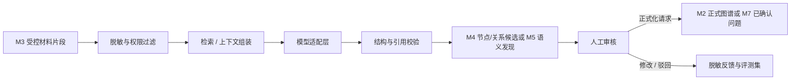

# 数据、图谱、评价与 AI 架构

## 1. 数据分层

系统必须把材料、候选、正式图谱和分析结论分层，避免 AI 输出被误当成权威事实。

| 层级 | 内容 | 是否可直接用于正式评价 |
| --- | --- | --- |
| 资源与材料层 | 教学资源及版本、原始文件、评分记录、学生报告与不可变版本 | 需经过授权、解析和映射 |
| 解析证据层 | 文本片段、表格、页码、OCR、来源坐标和内容哈希 | 否 |
| 候选审核层 | 识别出的节点、关系、冲突、置信度和人工决定 | 否，审核通过后提交正式图谱 |
| 正式图谱层 | 已发布节点、关系、来源、版本和生效周期 | 是，属于权威业务事实 |
| 分析应用层 | 诊断、评价、改进和支撑包的不可变运行或版本 | 按各自批准状态使用 |

基本约束：

- 候选不能被分析、评价或报告当作正式关系。
- 正式图谱 Schema、语义节点、关系和快照只能由 M2 发布和变更；M3 教学资源以固定版本引用进入图谱。
- 诊断发现不直接修改图谱，必须回到事实所属模块处理。
- AI 输出可以进入候选和解释，不进入正式数值计算路径。

## 2. 核心实体

### 2.1 工作上下文与治理

- `AccreditationWorkspace`：一次试点或认证工作的业务容器。
- `EvaluationCycle`：学期、学年或认证评价周期。
- `WorkspaceScopeSnapshot`：专业、课程、教学班和参与者范围快照。
- `WorkspaceMembership`：成员、职责和有效期。
- `ProcessingJob` / `JobAttempt`：异步任务权威状态和单次执行。
- `WorkItemIndex`：指向事实所属模块的待办索引。
- `RoleAssignment` / `DataScope`：角色与专业、课程、周期范围。
- `ModelDataPolicy`：数据级别和允许的模型范围。
- `AuditEvent`：关键操作、下载、审批和模型调用记录。

### 2.2 正式能力图谱

- `GraphSchemaVersion`：节点类型、关系类型、属性和约束版本。
- `GraphNode`：不随内容版本变化的稳定节点身份。
- `GraphNodeVersion`：节点在特定版本的名称、定义、属性和状态。
- `GraphEdgeVersion`：两个指定节点版本之间的正式有向关系。
- `CapabilityElement`：`Ability`、`Skill`、`Knowledge` 三类能力语义节点。
- `GraphSourceRef`：节点或关系对 M3 材料版本和证据片段的来源引用。
- `ExternalObjectVersionRef`：对 M3 教学资源等外部权威对象具体版本的引用。
- `GraphReviewDecision`：发布、变更、失效和批准记录。
- `GraphVersionSnapshot`：供分析、评价和支撑使用的图谱版本集合。
- `GraphImpact`：节点或关系变化影响的评价、改进和支撑对象。

首期主图节点限定为：

- 认证要求：`GraduateOutcome`、`PerformanceIndicator`；
- 能力语义：`Ability`、`Skill`、`Knowledge`；
- 教学承载：`Course`、`CourseOutcome`、`Experiment`；
- 评价结构：`AssessmentTask`、`RubricCriterion`；
- 资源支撑：`TeachingResource`，其权威内容与版本归 M3，M2 固定版本引用。

可观察行为、能力领域、认知层级、难度和资源类型是节点属性。专业、培养方案、评价周期和教学班是范围上下文；材料版本和证据片段是来源引用；识别候选、诊断发现、`EvaluationObject`、评价运行与结果、改进问题/措施和支撑包是应用记录。后三类都不是主图节点。

### 2.3 教学资源与证据

- `TeachingResource`：可跨材料引用的设备、软件环境、数据集、案例、仿真平台或指导资源的稳定身份。
- `TeachingResourceVersion`：资源名称、类型、能力边界、适用课程/实验、可用状态和有效期的不可变版本。
- `Material`：同一逻辑材料的稳定身份。
- `MaterialVersion`：不可变文件版本、对象键、内容哈希和状态。
- `MaterialClassification`：课程、周期、类型和确认状态。
- `EvidenceFragment`：页码、段落、表格坐标、OCR 区域和片段哈希。
- `SensitiveContentFinding`：个人信息或受限内容标记。
- `MaterialAccessEvent`：高风险查看、下载和外发记录。

教学资源与材料不可混用：教学资源回答“实验实际使用什么资产”，材料回答“课程大纲、指导书、评分表等内容记录在哪里”。一个教学资源可由多份材料描述，一份材料也可同时证明多个资源或图谱事实。M3 拥有资源及材料版本；M2 只保存固定资源版本引用及 `USES` / `ENABLES` 正式关系。

原始文件存入 S3 兼容对象存储；PostgreSQL 只保存业务元数据、对象键、哈希、来源坐标和权限信息。

本地开发阶段使用等价端口的轻量适配器：SQLite 保存材料元数据、M2 图谱工作区和 M6 评价试点仓储，本地内容寻址目录保存原件，FastAPI 后台任务执行扫描和解析。M2 图谱草稿使用聚合状态存储，正式快照与审计事件追加写入，并用修订号防止并发覆盖；M6 为评价对象、运行详情和不可变计算快照保存版本化 payload 与内部 SHA-256 完整性哈希，并允许从既有就绪快照同步追加重算运行。运行、计算、引用、`sourceRunId` 血缘与幂等命令在同一事务内持久化，`presentedRunId` 保持不变。输入预检不创建新的持久化对象，只在读取时从不可变运行快照派生。这仍不是包含评分导入、策略、审批、权限和审计的正式运行写模型。领域与应用层不依赖这些实现，试点部署可替换为 PostgreSQL、S3/MinIO 和 Celery，而不改变公开契约。

### 2.4 智能识别与人工审核

- `RecognitionRun`：一次识别任务，固定材料、图谱 Schema 和处理器版本。
- `NodeCandidate`：知识、技能、能力、课程、实验、考核任务或评分项等 M2 节点候选。
- `EdgeCandidate`：两个候选或已有节点间的关系候选。
- `CandidateEvidenceRef`：候选对应的原文来源。
- `CandidateConflict`：重复、冲突、无来源或版本不一致问题。
- `CandidateReviewDecision`：接受、修改、合并、拆分或驳回。
- `HumanFeedback`：脱敏后的修改原因与质量评测标签。

已接受候选不会原地变成正式事实，而是形成提交给 M2 的正式化请求，由 M2 校验和发布。教学资源候选必须先由 M3 解析为稳定资源版本；Rubric 分值和计分配置草稿进入 M6，而不是作为 M2 主图节点。

### 2.5 图谱分析与一致性诊断

- `AnalysisRuleVersion`：覆盖、一致性、结构和影响规则版本。
- `GraphAnalysisRun`：固定图谱、材料和规则的一次不可变运行。
- `DiagnosticFinding`：缺口、冲突、重复、过度集中或失效发现。
- `FindingEvidenceRef`：发现引用的节点、关系和材料证据。
- `FindingDecision`：确认、忽略、豁免或转为改进问题。
- `ImpactAnalysis`：版本变化的下游影响快照。

确定性规则发现和 AI 语义判断必须记录不同的 `finding_method`，不能混为同一可信等级。

### 2.6 达成度评价

- `RubricVersion` / `CriterionScoringRule`：计分量表、分值和规则；每个计分项引用 M2 的正式 `RubricCriterion` 节点版本。
- `ScoreImportBatch` / `ScoreRecord`：受控导入批次及原始或汇总评分记录。
- `EvaluationPolicyEdgeBinding`：为指定 `RubricCriterion CONTRIBUTES_TO CourseOutcome` 关系版本绑定权重和聚合参数。
- `EvaluationPolicyVersion`：公式、权重、阈值和缺失处理策略。
- `EvaluationInputSnapshot`：图谱版本、关系集合、数据范围和输入哈希。
- `DataValidationReport`：样本、缺失、异常和映射校验结果。
- `EvaluationObject`：M6 拥有的稳定评价目标；一个对象可以对应多个历史运行。
- `EvaluationRun`：一次不可变评价执行。
- `EvaluationResult`：各层级结果、中间值和结论。
- `EvaluationApproval`：复核和批准记录。

当前 M6 契约把对象队列和运行详情分开：`GET /api/v1/evaluations/objects` 在对象摘要上显式给出 `presentedRunId`，`GET /api/v1/evaluations/runs/{run_id}` 按不可变运行 ID 返回输入快照与计算明细。`GET /api/v1/evaluations/runs/{run_id}/preflight` 纯派生该运行的来源检查、计算派生阻断和缺失输入，固定输出 `scope=pilot_snapshot`、`reportVersion=evaluation-preflight:v1`，并为同一规范化报告生成确定性 `reportHash`。`POST /api/v1/evaluations/runs` 只以 `evaluationObjectId`、精确 `sourceRunId` 和 `Idempotency-Key` 表达创建意图，由服务端生成运行身份、时间、当前程序版本、完整试点输入摘要和确定性计算快照。`presentedRunId` 只决定队列默认展示的运行；创建新运行不改变该指针，也不删除、合并或重新绑定其他历史运行。

预检检查的责任和动作采用稳定枚举：`score_input / prepare_score_data`、`ability_graph / repair_graph_relation`、`evaluation_policy / review_evaluation_policy`、`evaluation_owner / inspect_input_snapshot`，通过项使用 `action=none`。这些值支持当前规则下的修复导航，但不代表已经创建责任分派、审批或审计记录；即使用户从 `prepare_score_data` 创建了本地试点汇总批次，原预检和原运行仍不改变。`repair_graph_relation` 也没有携带正式图谱目标身份，不能据此猜测具体节点或关系。

### 2.7 教学优化与持续改进

- `QualityIssue`：图谱缺口、材料冲突、评价未达标或数据问题。
- `RootCauseAnalysis`：原因分类、说明和依据。
- `ImprovementAction`：措施、负责人、期限和目标。
- `ActionChangeRef`：措施实际变更的课程、实验、材料、关系或评分规则版本。
- `VerificationPlan`：验证方法、目标和复评周期。
- `Reevaluation`：后续周期结果及有效性判断。
- `ClosureDecision`：关闭、继续或升级决定。

### 2.8 工程认证支撑

- `ReportTemplateVersion`：固定章节、字段和渲染规则版本。
- `SupportPackage`：特定工作空间和周期的支撑包。
- `ReportSectionSnapshot`：章节使用的正式事实和版本快照。
- `PackageValidationReport`：引用、状态、权限和敏感内容检查。
- `PackageApproval`：支撑包复核和批准记录。
- `ExportArtifact`：导出文件、内容哈希、审批和保留策略。

## 3. 图谱语义与权威关系

### 3.1 首版关系类型

```text
GraduateOutcome REFINES PerformanceIndicator
PerformanceIndicator EXPECTS Ability
Ability COMPOSED_OF Skill
Skill REQUIRES Knowledge

Course DEFINES CourseOutcome
Experiment BELONGS_TO Course
CourseOutcome SUPPORTS PerformanceIndicator
Experiment CONTRIBUTES_TO CourseOutcome
Experiment CULTIVATES Ability
Experiment TRAINS Skill
Experiment COVERS Knowledge

Experiment USES TeachingResource
TeachingResource ENABLES Skill / Knowledge

Experiment CONTAINS_TASK AssessmentTask
AssessmentTask CONTAINS_CRITERION RubricCriterion
RubricCriterion ASSESSES Ability / Skill
RubricCriterion CONTRIBUTES_TO CourseOutcome
```

`GraphSchemaVersion` 定义允许的起点类型、关系类型、终点类型、必填属性和基数约束。业务代码不得通过任意字符串创建新关系类型。

`ASSESSES` 表达直接测量对象，不能携带评价结论；`CONTRIBUTES_TO` 表达分数聚合去向，不能替代能力语义。分值、权重、阈值、样本和中间值归 M6 的计分配置、策略和运行快照，不进入 `GraphEdgeVersion`。

禁止存储以下快捷边：

- 课程目标直接支撑毕业要求；
- 实验直接支撑指标点或毕业要求；
- 评分项直接评价课程目标、指标点或毕业要求；
- 证据片段“证明”节点或关系；
- 评价结果、诊断发现或改进措施与教学对象之间的应用边；
- 反向边、传递闭包边或未经人工正式化的 AI 推断边。

反向导航、跨层路径和应用追溯由查询投影或引用解析生成，不建立第二套权威事实。完整端点和基数约束见 [ADR-001](decisions/001-experimental-teaching-ontology.md)。

### 3.2 正式关系字段

每条 `GraphEdgeVersion` 至少固定：

- 稳定关系身份和当前版本；
- 起点、终点及其具体节点版本；
- 关系类型和关系语义属性；
- 生效专业、课程和周期；
- 创建方式：人工、规则辅助或 AI 辅助；
- 证据片段和理由；
- 审核人、审核决定和时间；
- `effective`、`superseded` 或 `expired` 状态。

### 3.3 版本与生效

以下内容修改时不得原地覆盖历史值：

- 图谱 Schema、节点和正式关系；
- 教学资源、课程目标、实验项目、评分项和 Rubric 计分配置；
- 评价公式、权重、阈值和缺失策略；
- 诊断规则；
- 改进措施和实际教学对象变更；
- 报告模板和已批准支撑包；
- 模型提示模板、模型配置和处理器版本。

上游对象创建新版本后，旧关系不自动迁移。系统先产生影响清单，再由相应负责人确认新关系和适用周期。

### 3.4 所有权与状态分离

| 模块 | 权威对象 | 独立状态轴 |
| --- | --- | --- |
| M2 | 图谱 Schema、语义节点版本、关系版本、发布快照和审核决定 | 图谱修订生命周期；单项审核决定；节点/关系效力 |
| M3 | 教学资源/材料稳定身份与版本、处理产物和证据片段 | 材料处理状态；教学资源生命周期；当前有效版本 |
| M6 | 评价对象、计分配置、权重、阈值、评分输入、评价策略、运行和结果 | 输入就绪度；运行状态；达成结论；审批状态 |

M2 通过 `teaching_resource_version_id` 引用 M3，通过 `graph_node_version_id` 和 `graph_edge_version_id` 向 M6 提供正式结构。M3 不发布能力关系；M6 不修改图谱，也不把 `blocked`、`failed`、`not_achieved` 和 `rejected` 压缩为同一状态枚举。`blocked` 只属于输入就绪度；被阻断的运行读模型必须使 `result=null`，因而不产生 `outcome`。

### 3.5 存储选择

首期使用 PostgreSQL 保存图谱节点、边、版本、来源和状态，原因是：

- 权威关系需要事务、约束、版本和审计；
- 首期查询以受控路径、矩阵、覆盖和追溯为主；
- 可通过递归 CTE、物化视图或预计算满足试点规模；
- 避免在业务模型未稳定前引入图数据库双写。

当跨专业图规模、查询深度或实时图算法达到已测量瓶颈后，再评估图数据库作为查询投影；PostgreSQL 仍保留权威事实来源。

pgvector 只保存经过授权的脱敏片段向量，用于相似内容召回，不替代正式图谱关系。

## 4. 确定性分析与评价

### 4.1 图谱规则分析

规则和图算法负责：

- 必需路径是否完整；
- 节点或关系是否无来源、重复、断裂或失效；
- 能力、课程、实验和评分项覆盖是否不足或过度集中；
- 权重、分值、版本和生效周期是否冲突；
- 上游版本变化影响哪些评价、改进和支撑包。

每次 `GraphAnalysisRun` 固定：

- 图谱 Schema 和图谱版本；
- 材料版本；
- 分析规则版本；
- 范围、参数和豁免集合；
- 程序版本、发起人和运行时间。

### 4.2 达成度评价引擎

评价引擎负责：

- 读取正式 `ASSESSES` 关系确定评分项直接评价的能力或技能；
- 读取正式 `CONTRIBUTES_TO` 关系确定课程目标聚合路径；
- 按 `EvaluationPolicyEdgeBinding` 和已批准策略聚合分数；
- 执行缺失值、异常值和有效样本规则；
- 计算个体、课程目标、课程和毕业要求层面的结果；
- 输出完整中间值和解释字段，支持逐层复核。

不同专业可使用不同的版本化策略，例如加权平均法、阈值达标人数比例、直接与间接评价组合、多课程加权聚合。策略发布后不可原地修改。

大模型不得参与正式数值计算、补全缺失成绩或覆盖确定性规则结果。

当前试点仓储的加权贡献、权重闭合容差、三位小数四舍五入和阈值比较已在后端纯领域规则中使用 `Decimal` 执行，前端只映射并展示 OpenAPI 结果，不作为评价算法的执行边界。

`evaluation-preflight:v1` 在请求时读取不可变运行快照，保留快照中的来源就绪检查，并从缺失得分率、权重总和及计算阻断补充结构化检查和 `missingInputs`。其 `reportHash` 是当前规则版本下派生报告的确定性指纹，不持久化为审计快照，也不替代评分原件、学生明细、文件字段映射或输入快照的内容验签。

试点 seed 中展示为 `sha256:xxxx…xxxx` 的输入/证据哈希是截断界面值，不是可用于业务内容重新校验的完整哈希。新建试点运行会对当前可用的来源 payload 生成完整输入摘要；SQLite 仓储另行保存的 payload SHA-256 只用于内部持久化完整性检查，这些字段用途不同，不得混用或充当正式原始证据验签。

当前第一条评分数据写边界是默认关闭的 `local_pilot_aggregate` 汇总批次捕获。它按 `profile=local-pilot-aggregate:v1` 把精确对象、精确基准运行、候选输入集合、汇总已得分/可得分、观察样本数、内容哈希、稳定校验事实和幂等意图追加为不可变 `ScoreImportBatch`；完整性、唯一性与范围由校验报告判定，`validationStatus` 为 `blocked | pilot_ready`，整批通过后才生成规范 `ScoreRecord`，且固定 `formalUsable=false`。首次创建和同键同请求回放都返回 `201`，通过 `idempotentReplay` 区分。该批次不携带文件、个人记录、正式范围或操作者，不会被现有评价运行自动消费，也不改变历史预检。

正式数据写边界仍必须补齐工作空间、评价周期、课程/教学班范围、来源文件与内容哈希、字段映射、身份、RBAC、审批和审计，再由独立用例创建引用批次的新 `EvaluationInputSnapshot`。当前预检接口不得接收临时汇总分数，试点批次也不能被描述为已实现正式评分导入、学生级明细权限或不可变业务审计。

### 4.3 可复现要求

相同图谱快照、输入哈希、策略版本和程序版本必须得到相同结果。评价运行保存：

- 适用图谱与业务版本集合；
- 输入数据范围和内容哈希；
- 评价策略版本；
- 样本量、缺失率和异常处理；
- 中间值、输出分布、阈值和结论；
- 运行时间、程序版本、发起人和审核人。

日志不得输出不必要的学生个人成绩明细。

## 5. AI 处理链



### 5.1 适用任务

AI 适用于：

- 从非结构化材料提取课程、实验、知识、技能、能力、考核任务和评分项候选；
- 识别教学资源描述并提交 M3 解析，识别 Rubric 计分配置草稿并提交 M6 人工确认；
- 推荐节点之间的候选关系；
- 比较多份材料中的复杂语义差异；
- 基于已计算结果生成带引用解释；
- 为固定认证支撑章节生成带引用草稿。

确定性解析、权限、关系约束、图路径、数值计算和正式状态流转不交给 AI。

### 5.2 模型适配接口

模型通过逻辑能力名称调用，例如 `document-extractor`、`relation-suggester`、`consistency-analyzer`、`result-explainer`，部署配置再绑定实际模型。

请求至少包含用途、数据级别、允许模型范围、输出 Schema 和授权上下文；响应记录模型标识、配置版本、用量、延迟、结构化结果和来源引用。

### 5.3 可靠性与安全边界

- 模型输出先通过 JSON Schema / Pydantic 校验。
- 引用必须定位到当前授权范围内的材料版本和片段。
- 无引用、引用失效或越权上下文的结果不能提交正式审核。
- 低置信度、冲突关系和批量修改必须人工审核。
- 文件正文视为不可信输入，不能改变系统指令和权限边界。
- 学生材料进入外部模型前必须满足数据级别、脱敏和用途政策。
- 关闭模型后保留人工录入、规则诊断和完整业务闭环。

## 6. 追溯与影响链

核心链路使用稳定 ID 和不可变版本连接：

```text
workspace_id / evaluation_cycle_id
  → teaching_resource_version_id
  → material_version_id / evidence_fragment_id
  → recognition_run_id / candidate_review_decision_id
  → graph_schema_version_id / graph_node_version_id / graph_edge_version_id / graph_version_snapshot_id
  → graph_analysis_run_id / diagnostic_finding_id
  → evaluation_object_id / evaluation_policy_version_id / evaluation_input_snapshot_id / evaluation_run_id
  → quality_issue_id / improvement_action_id
  → changed_object_version_id / updated_graph_version_id
  → reevaluation_id
  → support_package_id / export_artifact_id
```

任何节点、关系、材料、规则或策略变化，都必须先通过影响分析识别下游对象；已批准结果不静默重算或覆盖。

## 7. 处理与质量可观测性

每个解析、识别、分析、评价和导出任务记录：

- 输入对象、版本和哈希；
- 处理器、规则、提示模板和模型版本；
- 开始、结束、重试次数和错误类别；
- 输出数量、低置信度项、冲突项和人工审核状态；
- 引用有效率、教师修改率和处理耗时；
- 模型标识与用量，但不记录不必要的完整敏感提示词。

这些信息用于质量评测、成本分析、影响分析和问题回溯，不作为替代业务审计的普通应用日志。
