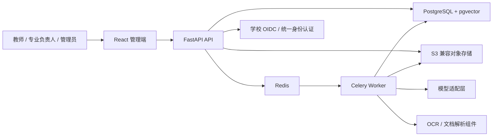

# 总体技术架构

## 1. 架构目标

系统首先服务校内试点，需要在可维护、可部署和可审计之间取得平衡。首期采用**单仓库、模块化单体、独立进程部署**：

- 一个 React 管理端。
- 一个 FastAPI API 服务。
- 一个或多个 Celery Worker。
- PostgreSQL、Redis 和 S3 兼容对象存储。

各业务模块在代码和数据库访问层保持明确边界，但暂不拆成网络微服务。只有当团队、扩缩容或安全隔离出现明确需求时再拆分。

## 2. 系统上下文



## 3. 技术选型

### 3.1 前端

- React + TypeScript + Vite。
- Ant Design 作为成熟管理端组件库。
- TanStack Query 管理服务端状态和缓存。
- React Hook Form + Zod 管理复杂表单和前端校验。
- 路由按业务能力拆分，页面只组合功能模块，不直接实现领域规则。

状态管理原则：

- 组件交互状态使用 `useState` / `useReducer`。
- 服务端数据使用 TanStack Query。
- 会话、当前专业和全局展示偏好使用小范围 Context。
- 首期不默认引入 Redux；只有出现可证明的跨页面复杂客户端状态时再评估。

### 3.2 后端

- FastAPI 提供 REST API 和 OpenAPI 文档。
- Pydantic 定义请求、响应和领域边界模型。
- SQLAlchemy 2.x 和 Alembic 管理持久化与迁移。
- Celery 运行解析、OCR、向量化、批量评价和导出任务。
- Redis 作为消息代理和短期协调组件，不作为业务事实来源。

### 3.3 数据与文件

- PostgreSQL 保存权威关系、版本、任务状态、评价结果和审计记录。
- pgvector 保存经过授权的脱敏片段向量，用于语义召回。
- 原始文件、解析产物和导出包保存在 S3 兼容对象存储。
- MinIO 仅作为试点环境的默认实现；生产环境优先适配学校已有对象存储，并完成许可证与运维评审。

### 3.4 身份认证

- 优先接入学校 OIDC。
- 推荐后端代理登录并使用 `HttpOnly`、`Secure`、`SameSite` Cookie 保存会话，避免浏览器长期持有访问令牌。
- 若现有环境要求纯前端客户端，使用 Authorization Code + PKCE。
- 学校仅提供 SAML、CAS 或 LDAP 时，可用 Keycloak 作为身份代理，再向本系统提供 OIDC。

### 3.5 模型

- 业务模块只依赖统一模型接口，不直接调用厂商 SDK。
- 模型、部署方式、超时、重试、数据保留策略和能力标签由配置决定。
- 外部模型默认禁止接收未经脱敏的学生材料。

## 4. 建议仓库结构

```text
apps/
  web/
    src/
      app/          # 启动、路由、全局提供者
      views/        # 页面级组合
      widgets/      # 业务复合区块
      features/     # 用户动作与业务功能
      entities/     # 前端领域展示模型
      shared/       # 通用组件、请求和工具
  api/
    app/
      main.py
      modules/      # 按领域模块组织
      platform/     # 数据库、对象存储、身份、观测性
  worker/
    app/
      tasks/        # 异步任务入口
      pipelines/    # 文档、向量、评价、导出流水线
packages/
  api-client-generated/  # 从 OpenAPI 生成，禁止手工维护
infra/
  compose/
  migrations/
docs/
```

这是结构目标，不要求在文档阶段提前创建空目录。

## 5. 后端领域模块

| 模块 | 职责 |
| --- | --- |
| `identity_access` | 用户、角色、组织范围和 OIDC 会话 |
| `standards` | 认证标准、毕业要求、指标点及版本 |
| `curriculum` | 专业、培养方案、课程体系 |
| `courses` | 课程、课程目标、学期和教学班 |
| `experiments` | 实验项目、环节、知识点和能力点 |
| `assessments` | Rubric、评分项、权重、评价策略 |
| `evidence` | 文件、片段、学生证据和来源定位 |
| `evaluations` | 确定性达成度计算、快照和复核 |
| `improvements` | 问题、措施、责任人、复评和闭环 |
| `intelligence` | 抽取、检索、关系建议和模型适配 |
| `reporting` | 报表、认证支撑包和导出 |
| `audit` | 操作、下载、审批和模型调用审计 |

每个模块内部按边界层、应用层、领域层和基础设施层组织。路由只处理协议和鉴权；领域规则不放在路由、ORM 模型或 Celery 任务入口中。

## 6. API 契约

### 6.1 单一来源

FastAPI 的 Pydantic 请求/响应模型是 API 契约源。CI 导出固定版本的 `openapi.json`，再生成 TypeScript 客户端。

禁止：

- 前端和后端分别手写同名类型。
- 直接向前端暴露 ORM 模型。
- 在响应中无版本地改变字段含义。

### 6.2 REST 约定

- 路径使用复数资源名，如 `/api/v1/courses/{course_id}/objectives`。
- 长任务创建后返回 `202 Accepted` 和任务资源地址。
- 幂等创建使用客户端请求键或业务唯一约束。
- 分页、筛选和排序使用统一查询结构。
- 错误响应包含稳定的业务错误码、用户可读信息和关联请求 ID。
- 正式资源使用乐观锁或版本号避免覆盖并发修改。

### 6.3 契约发布门槛

- OpenAPI 生成成功。
- 生成的 TypeScript 客户端无未提交差异。
- 破坏性变更有版本迁移说明。
- 示例不含真实个人数据。

## 7. 异步任务

适合异步执行的任务包括文件解析、OCR、表格识别、个人信息检测、向量化、批量评价、模型分析和报表导出。

任务规则：

- 消息只携带任务 ID、对象键和必要的小型参数，不携带文件字节或大段正文。
- 任务权威状态写入 PostgreSQL，Redis 不作为最终状态存储。
- 每个任务具备幂等键、重试策略、超时、进度和错误分类。
- 任务产物保存输入哈希、处理器版本和输出版本。
- 模型调用与确定性评价分开排队，避免资源相互挤占。

## 8. 部署拓扑

### 8.1 开发和首期试点

Docker Compose 编排：

- `web`
- `api`
- `worker-document`
- `worker-ai`
- `postgres`
- `redis`
- `object-storage`（没有学校存储时使用）
- 反向代理

数据库迁移由独立发布步骤执行，不在所有 API 实例启动时抢跑。

### 8.2 生产基线

- 校内 HTTPS 域名和受控网络区域。
- API、Worker 使用独立服务账户和最小权限。
- 数据库、对象存储和密钥不暴露到公网。
- 关键数据定期备份并执行恢复演练。
- 日志、指标和追踪统一关联请求 ID / 任务 ID。

### 8.3 何时考虑 Kubernetes

仅在出现以下一种或多种情况时评估：

- Worker 需要按任务类型独立弹性扩缩容。
- 多套院系实例需要统一调度。
- 发布频率、可用性目标和运维团队已能承担集群复杂度。
- 安全策略要求更强的工作负载隔离。

## 9. 官方技术参考

- [FastAPI OpenAPI 文档](https://fastapi.tiangolo.com/reference/openapi/docs/)
- [pgvector 官方仓库](https://github.com/pgvector/pgvector)
- [Celery：Brokers and Backends](https://docs.celeryq.dev/en/latest/getting-started/backends-and-brokers/index.html)
- [MinIO 容器部署文档](https://min.io/docs/minio/container/index.html)
- [Keycloak Server Administration Guide](https://www.keycloak.org/docs/latest/server_admin/)
