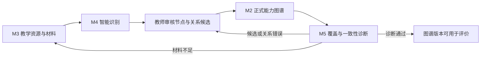
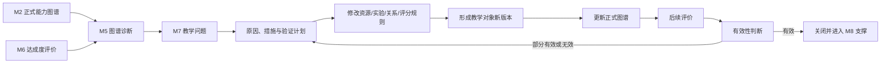

# 实验教学能力图谱端到端闭环

## 1. 闭环目标

系统必须同时完成两条可验证闭环：

1. 把分散材料转成有来源、有审核、有版本的正式实验教学能力图谱；
2. 基于图谱和确定性评价发现教学问题，将措施落实到教学对象新版本，并通过后续评价验证效果。

最终应能证明：

> 一项能力结论可以追溯到毕业要求、课程目标、实验、知识/技能、评分项和原始证据；一项教学改进可以追溯到问题、措施、实际变更、图谱更新和复评结果。

## 2. 图谱构建闭环



| 步骤 | 责任角色 | 关键动作 | 交付物 |
| --- | --- | --- | --- |
| 1. 准备上下文 | 专业负责人 | 确认专业、课程和周期 | 工作空间范围 |
| 2. 导入资源 | 教师 | 上传、分类、解析和确认材料 | 就绪材料版本、证据片段 |
| 3. 识别候选 | 系统 | 提取节点并推荐关系 | 带来源候选 |
| 4. 人工审核 | 教师、负责人 | 修改、合并、拆分、驳回和批准 | 已审核候选 |
| 5. 发布图谱 | 专业负责人 | 校验版本、来源和关系类型 | 正式图谱版本 |
| 6. 一致性诊断 | 系统、教师 | 检查覆盖、冲突、重复和断点 | 诊断报告 |
| 7. 反馈修正 | 对应责任人 | 补材料或修正候选与关系 | 新材料或新图谱版本 |

### 2.1 图谱交接门槛

| 交接 | 必须满足 |
| --- | --- |
| M3 → M4 | 文件安全检查通过、分类确认、来源位置可用 |
| M4 → M2 | 结构和引用校验通过、人工决定完成、审核权限满足 |
| M2 → M5 | 节点和关系已发布、两端版本与生效周期明确 |
| M5 → M6 | 评价所需正式关系完整，缺口已修正或获批豁免 |

## 3. 教学持续改进闭环



| 步骤 | 责任角色 | 关键动作 | 交付物 |
| --- | --- | --- | --- |
| 1. 发现问题 | 系统、负责人 | 从图谱诊断或评价异常创建问题 | 有来源的问题 |
| 2. 分析原因 | 课程负责人 | 确认根因和影响范围 | 原因分析 |
| 3. 制定措施 | 改进责任人 | 选择改进对象、目标和验证方法 | 已批准措施 |
| 4. 执行变更 | 教师 | 修改资源、实验、关系或评分规则 | 教学对象新版本 |
| 5. 更新图谱 | 教师、负责人 | 审核新节点、关系和影响 | 新图谱版本 |
| 6. 后续评价 | 评价负责人 | 用新周期数据重新评价 | 新评价运行 |
| 7. 判断效果 | 专业负责人 | 对比基线、目标和复评结果 | 有效性结论 |
| 8. 关闭或继续 | 专业负责人 | 关闭、修订或新增措施 | 完整改进闭环 |

### 3.1 改进交接门槛

| 交接 | 必须满足 |
| --- | --- |
| M5/M6 → M7 | 诊断或评价结果已确认，来源和基线可下钻 |
| 措施 → 教学变更 | 负责人、期限、目标和验证方法已定义 |
| 教学变更 → M2 | 新资源、实验、关系或评分规则版本已审核 |
| 新图谱 → M6 | 影响关系已重新确认，评价输入校验通过 |
| 复评 → 关闭 | 实际结果与目标完成比较，关闭决定获批准 |

## 4. 核心追溯链

```text
workspace_id / evaluation_cycle_id
  → material_version_id / evidence_fragment_id
  → recognition_run_id / candidate_review_decision_id
  → graph_schema_version_id / graph_node_version_id / graph_edge_version_id
  → graph_analysis_run_id / diagnostic_finding_id
  → evaluation_policy_version_id / evaluation_run_id
  → quality_issue_id / improvement_action_id
  → changed_object_version_id / updated_graph_version_id
  → reevaluation_id
  → support_package_id
```

所有正式版本和运行快照不原地覆盖。

## 5. 关键回退路径

### 材料不可用

文件校验、解析、脱敏或分类失败时，材料停留在 M3；用户重新上传、修正分类或重试。

### 识别结果不可信

结构校验、引用校验或人工审核失败时，候选停留在 M4，不进入正式图谱。

### 图谱存在断点或冲突

M5 发现无来源、版本不一致、覆盖缺口或材料矛盾时，返回 M3/M4 补证或修正。

### 评价输入不完整

正式关系、评分数据、样本或策略不满足要求时，M6 阻断运行，不允许 AI 填补正式数值。

### 改进无效

复评为部分有效或无效时，M7 不关闭问题，保留原措施并要求修订或新增措施。

## 6. 首个可验收闭环

首个试点只选择：

- 1 个专业；
- 1 门课程；
- 2～3 个实验项目；
- PDF、DOCX、扫描件各至少一份；
- 1 套可人工复算的评分数据；
- 1 组历史或复评样例；
- 至少 1 个需要改进的问题。

验收演示必须完成：

1. 从材料识别一个实验、知识点、能力点和评分项；
2. 教师审核并发布一条完整图谱路径；
3. 发现并处理一项覆盖或材料一致性问题；
4. 运行确定性评价并与人工样例一致；
5. 从诊断或未达标结果创建改进措施；
6. 关联实际教学对象新版本并更新图谱；
7. 录入复评结果并判断改进有效性；
8. 导出带来源、版本和审批记录的认证支撑包。

## 7. 闭环指标

- 正式图谱节点和关系具备有效来源与审核记录：100%。
- 图谱诊断结果可追溯到规则、图谱和材料版本：100%。
- 已批准评价可追溯到策略、输入和图谱版本：100%。
- 相同输入、策略和程序版本重算一致：100%。
- 已关闭问题具备实际变更和复评结论：100%。
- 支撑包正式结论具备有效来源链：100%。
- 越权读取、审核、模型调用和导出阻断：100%。
